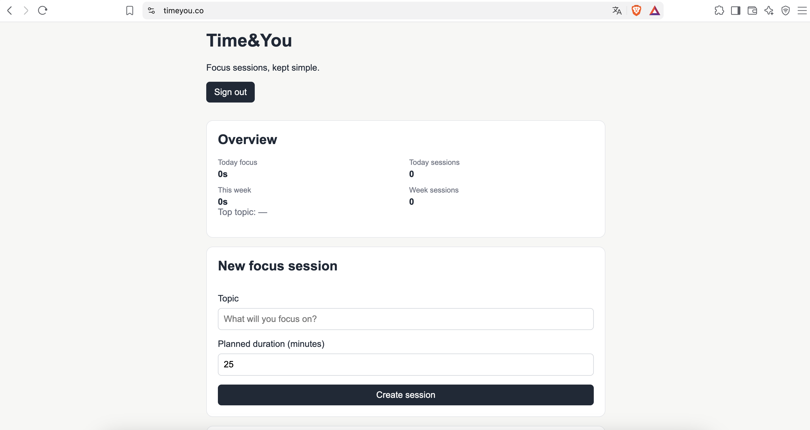
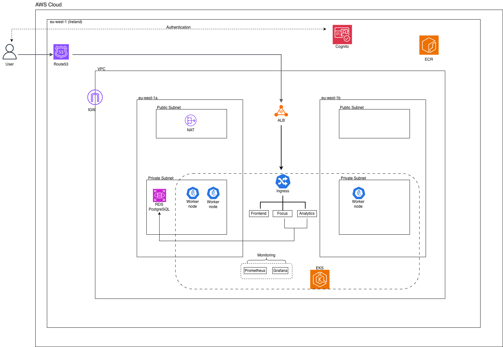
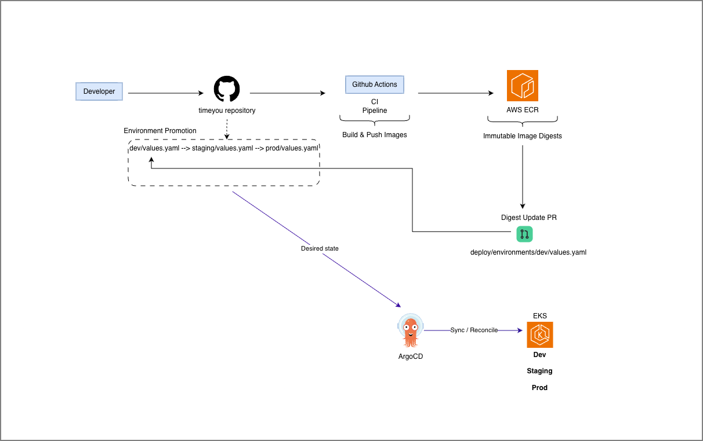
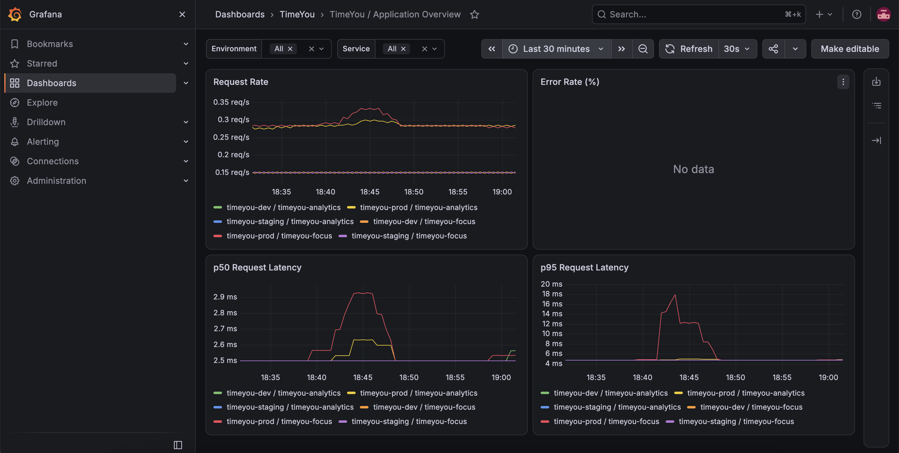
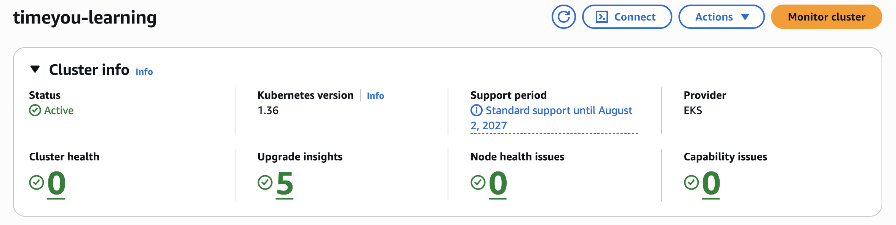
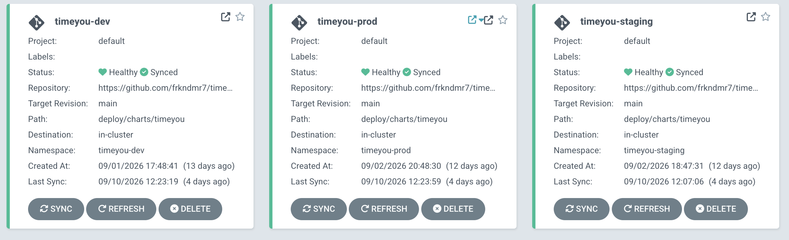
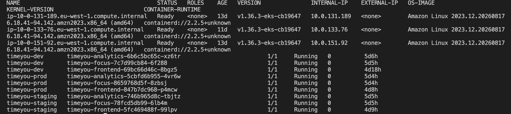

# TimeYou

TimeYou is a containerized productivity application for tracking focused work sessions. It combines a Next.js frontend with FastAPI-based Focus and Analytics services backed by PostgreSQL. The project is also a practical cloud and DevOps implementation built around AWS, Amazon EKS, Infrastructure as Code, and GitOps.

**Tech stack:** AWS · Terraform · Amazon EKS · Kubernetes · Helm · Argo CD · GitHub Actions · Amazon ECR · PostgreSQL / RDS · Amazon Cognito · Prometheus · Grafana

## Application Overview

The frontend provides the user experience for authentication, focus sessions, session history, and analytics. The Focus Service manages session operations, while the Analytics Service provides summary data; both are implemented with FastAPI and use PostgreSQL for persistence and related queries.



_TimeYou running at `https://timeyou.co` during the production deployment._

## AWS Architecture



The platform runs in AWS eu-west-1 inside one VPC spanning two Availability Zones. Public and private subnets are separated: an internet-facing Application Load Balancer provides external HTTP/HTTPS entry, while EKS worker nodes and the PostgreSQL RDS instance remain on the private side. Private workloads use a NAT Gateway for outbound access.

Route 53 provides DNS for the public domain, ACM provides the TLS certificate, and Amazon Cognito provides OIDC authentication. Kubernetes Ingress is declarative routing configuration translated by the AWS Load Balancer Controller into ALB listeners and routing rules; it is not represented as an additional physical proxy or network hop.

## Kubernetes & Environments

TimeYou uses one Amazon EKS cluster with separate namespaces for environment isolation:

- `timeyou-dev`
- `timeyou-staging`
- `timeyou-prod`

Each environment runs the frontend, Focus Service, and Analytics Service from the same Helm chart with environment-specific values. Promotion uses immutable image digests so that the artifact verified in development can be promoted without rebuilding it.

## GitOps Delivery



The delivery flow is:

**Developer → GitHub → GitHub Actions → Amazon ECR → digest update in Git → Argo CD → Amazon EKS**

Git is the desired-state source of truth. GitHub Actions builds and publishes immutable images, then updates the development image digests through a pull request. Argo CD reconciles the application manifests from Git with the EKS cluster; CI does not deploy directly to Kubernetes.

After development validation, the same verified immutable digests are promoted to staging and production through controlled pull requests. The artifact is built once and promoted unchanged:

> Build once, promote the same immutable artifact.

## Infrastructure as Code

Terraform owns the platform and infrastructure lifecycle, including VPC networking, EKS, RDS, Cognito, Route 53/ACM, Argo CD, and platform add-ons such as the AWS Load Balancer Controller, Metrics Server, Prometheus, and Grafana.

Argo CD owns TimeYou application delivery for the dev, staging, and production environments. **Terraform provisions the platform; Argo CD delivers the application.**

## Repository Structure

```text
frontend/                         Next.js frontend
services/
  focus-service/                  Focus session API
  analytics-service/              Analytics API
infrastructure/terraform/        AWS and platform Terraform
deploy/
  argocd/                         Application definitions
  charts/timeyou/                 Shared application Helm chart
  environments/dev/               Development values
  environments/staging/           Staging values
  environments/prod/              Production values
```

## Observability

Prometheus collects Kubernetes and application telemetry, while Grafana provides dashboards for the collected data. Metrics Server supplies Kubernetes CPU and memory resource metrics for nodes and pods.

Focus and Analytics expose application HTTP metrics for request rate, error rate, and request latency. The application dashboard presents p50 and p95 latency by environment and service, together with request-rate and error-rate views.



_Application metrics in Grafana, including request rate, error rate, and p50/p95 latency._

## Deployment Evidence

The following screenshots were captured while the project was deployed and verified in the real AWS/EKS environment. The infrastructure may later be destroyed to avoid ongoing cloud costs, but these records preserve evidence of the working deployment.



_Active Amazon EKS cluster._



_Development, staging, and production applications Healthy and Synced in Argo CD._



_Three Ready EKS worker nodes with TimeYou workloads running across all three namespaces._
